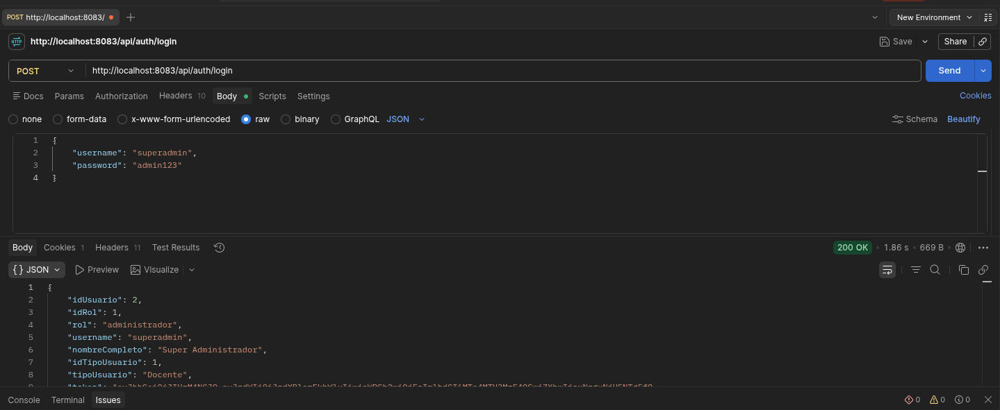

# Comandos en postman para probar el proyecto
## Credenciales admin
Username: admin
Password: admin123

## Autenticación (Puerto 8083)
1. Iniciar sesión (login)
POST 
/api/auth/login

JSON
{
    "username": "superadmin",
    "password": "admin123"
}

{
    "username": "user",
    "password": "password"
}

### Nota: 
(Copia el token de la respuesta y pégalo en la pestaña Authorization y busca donde dice Bearer Token de Postman para las peticiones que lo requieran :p)

## Usuarios (Puerto 8083)

1. Registrar usuario

POST 
/api/user/register

Body: JSON
{
    "nombre": "nombre",
    "apellidoPaterno": "apellidoPaterno",
    "apellidoMaterno": "apellidoMaterno",
    "correo": "correo",
    "username": "username",
    "password": "password",
    "idRol": 1,
    "idTipoUsuario": 1,
    "idProgramaEducativo": 1
}
Authorization: Bearer <token>

### Nota: 
Para registrar un usuario se necesita un token de un usuario Administrador (idRol=1)

2. Verificar si existe usuario
GET 
/api/user/{idUsuario}/exist

3. Verificar estatus del usuario
GET 
/api/user/{claveUsuario}/status

4. Obtener perfil del usuario
GET 
http://localhost:8083/api/user/profile/10
Bearer <token>

5. Editar usuario
PUT 
/api/user/{idUsuario}

Body: JSON
{
    "nombre": "nombre",
    "apellidoPaterno": "apellidoPaterno",
    "apellidoMaterno": "apellidoMaterno",
    "correo": "correo",
    "telefono": "telefono",
    "idRol": 1,
    "idTipoUsuario": 1,
    "idProgramaEducativo": 1
}

6. Cambiar estatus del usuario
PATCH 
/api/user/{idUsuario}/estatus

## Vehículos (Puerto 8084)
*Nota: Todos los endpoints de vehículos requieren el token de acceso en la pestaña "Authorization -> Bearer Token"*

1. Registrar vehículo
POST 
http://localhost:8084/api/vehiculos

Body: JSON
{
    "idUsuario": 1,
    "idModelo": 1,
    "placa": "XYZ123",
    "color": "Rojo",
    "anio": 2022,
    "descripcion": "Vehículo de uso diario"
}

2. Buscar vehículos por usuario
GET 
http://localhost:8084/api/vehiculos/{idUsuario}

3. Editar vehículo
PUT 
http://localhost:8084/api/vehiculos/{idVehiculo}

Body: JSON
{
    "idUsuario": 1,
    "idModelo": 2,
    "placa": "XYZ123",
    "color": "Azul",
    "anio": 2023,
    "descripcion": "Color actualizado"
}
(Solo el dueño del vehículo puede editarlo)

4. Cambiar estatus del vehículo (Activar/Desactivar)
PATCH 
http://localhost:8084/api/vehiculos/{idVehiculo}/estatus?idUsuario={idUsuario}
(El parámetro `idUsuario` en la URL sirve para verificar que el usuario que hace la petición es el dueño del vehículo)
